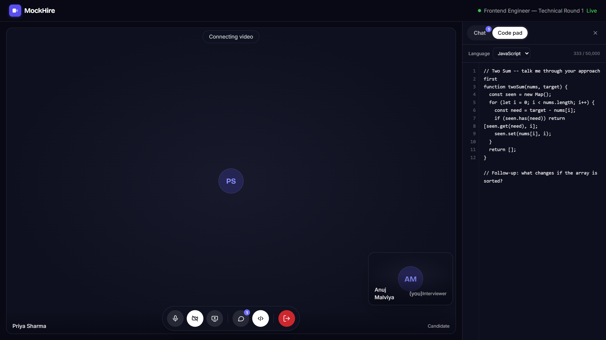
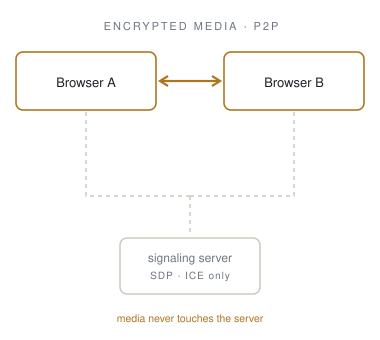
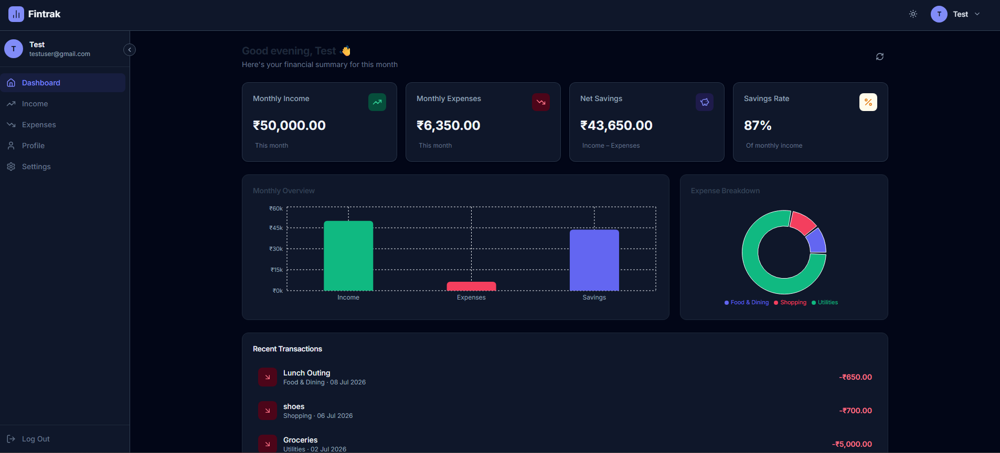

<picture>
  <source media="(prefers-color-scheme: dark)" srcset="assets/banner-dark.svg">
  
</picture>

 

I build full-stack systems from primitives — and stay to fix what breaks in production.

Every project I've shipped has taught me the same lesson from a different angle: the happy path is the easy part. A peer-to-peer interview platform, a finance dashboard, a notes app on Redis-backed rate limiting, even a throwaway quote generator against an API that allows five requests an hour — each one turned out to be about failure states. Reconnection, cold starts, race conditions, 429s.

On MockHire I chose raw WebRTC over a paid SDK, then spent a week fixing offer collisions and ghost disconnects a managed service would have hidden. I'd make the same call again.

 

---

 

  
  &nbsp;
  <picture>
    <source media="(prefers-color-scheme: dark)" srcset="assets/p2p-dark.svg">
    
  </picture>

  <b>MockHire</b> — peer-to-peer technical interviews. 
  Media never touches my server. No Twilio, no Agora, no SDK.

  
  &nbsp;
  

 

### Current focus

- **Building** — Production-grade full-stack applications with AI, real-time communication, and scalable architectures
- **Learning** — Cloud-native deployments, DevOps practices, scalable system design, and software architecture
- **Exploring** — Agentic AI systems, developer tooling, and building software that scales gracefully in production

 

---

 

### Featured work

#### 01 · MockHire

Self-hosted technical interview platform — P2P video, shared editor, structured feedback.

- Media bypasses the server entirely. It relays only SDP and ICE, which makes calls **physically un-recordable by design** rather than un-recorded by policy.
- Room codes are 128 bits from `crypto.randomBytes`, authorized server-side per socket against the DB, with an 8-hour expiry. A leaked URL still doesn't get you in.
- **52 integration tests** against a live server and a real database, covering IDOR, feedback privacy, socket authorization, and survival of a mid-flight DB outage.
- Binds its port *before* connecting to Mongo, then returns `503` + `Retry-After` until ready. Cold starts don't drop traffic.

React · Socket.IO · WebRTC · Express · MongoDB · Tailwind

 

#### 02 · Fintrak

  

Personal finance dashboard — income and expense tracking with analytics and Excel export.

- Split deployment across Vercel and Render with CORS pinned to a single origin.
- Monthly overview and category-distribution charts, savings-rate computation, dark and light themes.

React 19 · Recharts · Express · MongoDB · JWT

 

 

Also here — <b>ThinkBoard</b>, a notes app with a Redis sliding-window limiter and a dedicated 429 state · <b>NeetCode-150</b>, ongoing DSA practice.

 

### How I work

> **Decisions get written down.**
> Every milestone in MockHire has a decision record in `docs/decisions/`. Six months from now I can still explain why the server binds before it connects — and, more usefully, what I'd have to believe to change it.

> **Bugs get instrumented, not guessed at.**
> Instrument, reproduce, fix, document, then remove the instrumentation. Three separate WebRTC failures went through that loop — including one I introduced while fixing the previous one. No diagnostic logging survived into `main`.

> **Security is a default, not a feature.**
> JWTs in httpOnly cookies rather than localStorage. Token-version revocation so logging out actually invalidates. Roles re-read from the database on every request instead of trusted from a payload the client holds.

> **Failure is the default case.**
> Servers boot before their database is reachable. Peers refresh mid-call. Free-tier APIs cut you off at five requests an hour. I design for those first and treat the happy path as the special case.

 

---

 

### Stack

- **Core** — React · Node · Express · MongoDB · Socket.IO
- **Real-time** — WebRTC · WebSockets · Redis
- **Also** — Tailwind · Bootstrap · C++

 

### Activity

  
  

  

 

---

 

### Contact

  
  &nbsp;
  

  B.Tech CSE, VIT Bhopal · open to backend and full-stack roles

 

  <i>The bug you can't reproduce is the one you haven't instrumented yet.</i>

